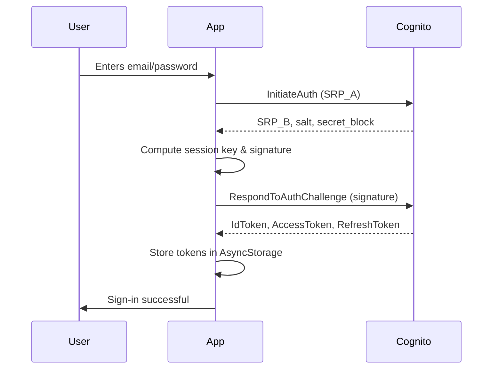
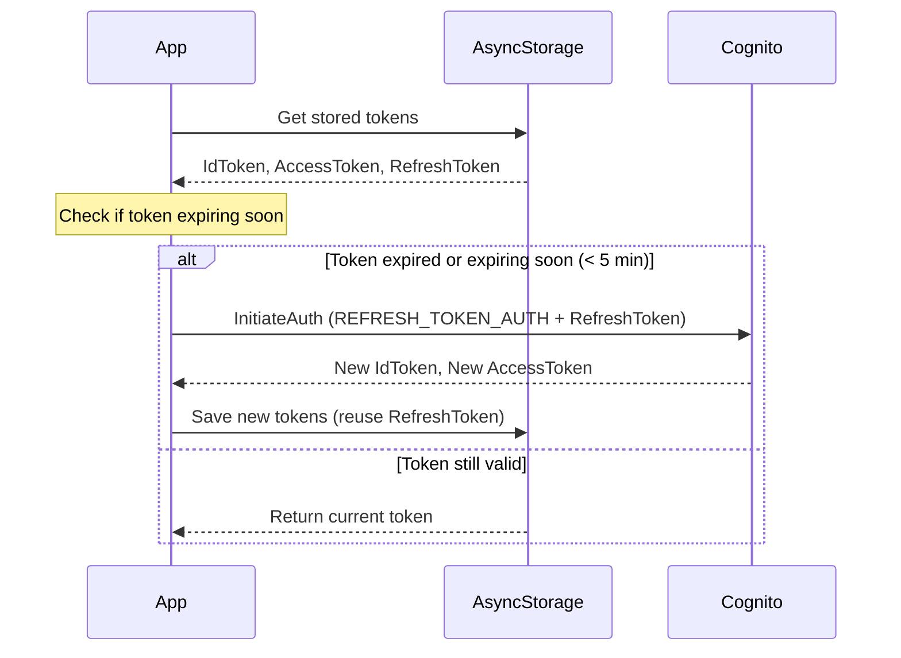

# Lemuel

A daily proverb app that displays a new proverb each day and encourages users to meditate on it.

## What the app does

- Fetches a daily proverb from an API and displays it in the app
- Shows a widget on the home screen with today's proverb (auto-updates daily)
- Schedules push notifications to remind the user to read the proverb of the day

## Ultimate Goals

- ✅ **Widget** - Home screen widget showing the Daily Proverb
- ✅ **Push Notifications** - Push notifications reminding users to meditate on the daily proverb
- Notes/comments system for personal reflections (public or private)

Backend is separate (AWS Lambda). API changes needed for features beyond the app's direct functionality.

## Development Guidelines

- Uses pnpm and TypeScript
- Check which shell / environment you are running in before starting to avoid wasted effort. for example if you're running in PowerShell you can't use grep
- Unit tests required
- Don't modify generated files (e.g., android folder - regenerated on build)
- Follow Expo documentation
- Avoid building/running unless asked; if needed, ask first
- Avoid running tests unless asked because this slows down the feedback loop
- Optimize imports

# Widget Implementation

The app displays a home screen widget showing today's proverb, automatically updating daily.

## Architecture

- **Voltra** - Provides Android widget support via Jetpack Compose Glance
- **Background Task** - Scheduled daily updates via expo-background-task
- **Config** - Widget defined in app.json plugins

## Key Files

- `src/widgets/proverb-widget.tsx` - Widget component
- `src/widgets/index.tsx` - Widget registration
- `src/background/proverb-task.ts` - Background update scheduling
- `app.json` - Voltra plugin configuration

# Push Notifications

The app uses `expo-notifications` to schedule daily push notifications to remind the user to read the proverb of the day.

## Key Files
- `src/notifications/daily-proverb-notification.ts` - Logic for scheduling daily proverb notifications.
- `src/notifications/notification-preferences.ts` - Logic for storing and retrieving notification preferences.
- `src/utils/battery-optimization.ts` - Logic for disabling battery optimization to ensure notifications are delivered.

# Daily Proverbs

The app fetches the proverb of the day from a remote API.

## Key Files
- `src/hooks/useProverbForTheDay.ts` - Hook for fetching the proverb of the day.
- `src/api/proverbs.ts` - API client for fetching proverbs.
- `src/components/proverb-card.tsx` - Component for displaying a proverb.
- `src/models/proverb.ts` - Proverb data model.

# Authentication Flow

The app uses AWS Cognito for authentication with SRP (Secure Remote Password) for sign-in and automatic token refresh.

## Overview

Authentication in the app follows this pattern:

1. **Sign Up** - User creates account with email/password
2. **Verify** - User confirms account with verification code
3. **Sign In** - Full SRP authentication flow with Cognito
4. **Token Storage** - Tokens stored in AsyncStorage
5. **Proactive Refresh** - Automatic token refresh before expiration
6. **Silent Sign-out** - Clear tokens on refresh failure (no redirect)

## Sign-In Flow (SRP)



### Key Points

- **SRP (Secure Remote Password)** - Password never sent to server
- **Three tokens returned**:
  - `IdToken` - Contains user identity (userId, email)
  - `AccessToken` - Short-lived (~1 hour), used for API calls
  - `RefreshToken` - Long-lived (~30 days), used to get new tokens
- Uses `USER_SRP_AUTH` flow in Cognito

## Token Refresh Flow

The app automatically refreshes tokens before they expire, both proactively (before API calls) and reactively (on 401 response).



### Proactive Refresh Functions

Call these functions before making authenticated API calls:

- `getValidAccessToken()` - Returns valid access token, refreshes if needed
- `getValidIdToken()` - Returns valid ID token, refreshes if needed

### Silent Sign-Out

If refresh fails (e.g., refresh token expired):

1. Clear all tokens from AsyncStorage
2. Set user to null in AuthContext
3. App continues functioning (unauthenticated)
4. No redirect, no error message shown

## Key Files

| File                        | Purpose                                       |
| --------------------------- | --------------------------------------------- |
| `src/auth/auth-context.tsx` | React Context providing auth state to app     |
| `src/auth/token-storage.ts` | AsyncStorage read/write for tokens            |
| `src/auth/token-utils.ts`   | Token expiration checking utilities           |
| `src/api/auth.ts`           | Auth API functions (signIn, signOut, refresh) |
| `src/api/cognito.ts`        | Low-level Cognito SDK calls                   |

## Using Auth in Components

```typescript
// Get auth context
const { user, signOut, refreshToken } = useAuth();

// Get valid token before API call
const token = await auth.getValidAccessToken();

// Manual refresh (if needed)
const success = await refreshToken();
```

## Token Expiration Times

| Token Type    | Default Lifetime | Configurable |
| ------------- | ---------------- | ------------ |
| Access Token  | 1 hour           | Yes          |
| IdToken       | 1 hour           | Yes          |
| Refresh Token | 30 days          | Yes          |
