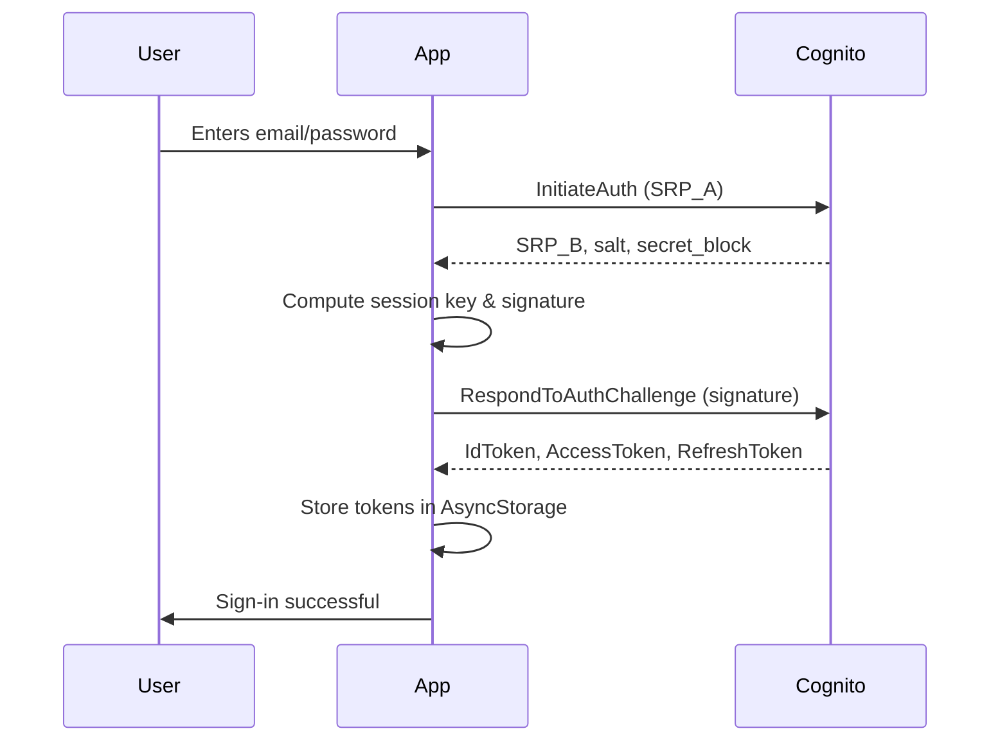
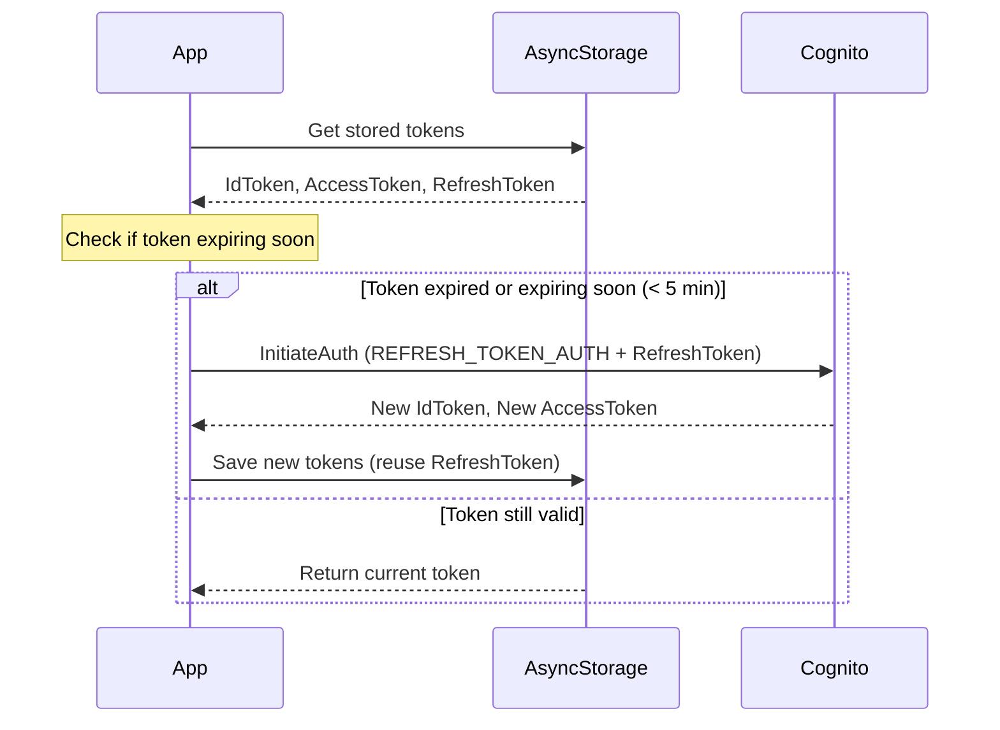

# Lemuel

A daily proverb app that displays a new proverb each day and encourages users to meditate on it.

## Features

- **Daily Proverb**: Fetches a daily proverb from an API and displays it in the app.
- **Home Screen Widget**: Shows today's proverb on the home screen and auto-updates daily.
- **Push Notifications**: Schedules push notifications to remind the user to read the proverb of the day.

## Future Goals

- **Notes/Comments System**: A feature for personal reflections, with options for public or private notes.

## Tech Stack

- **Frontend**: React Native with Expo
- **Backend**: AWS Lambda (managed separately)
- **Authentication**: AWS Cognito

## Development

### Prerequisites

- [Node.js](https://nodejs.org/)
- [pnpm](https://pnpm.io/)
- [Expo CLI](https://docs.expo.dev/get-started/installation/)

### Getting Started

1.  **Install dependencies**:
    ```bash
    pnpm install
    ```
2.  **Run the app**:

    This project includes native code and is **not compatible with Expo Go**. You must run it in a development build on a simulator or physical device.

    ```bash
    # Run on Android
    pnpm android

    # Run on iOS
    pnpm ios
    ```

## Architecture

### Widget Implementation

The app displays a home screen widget showing today's proverb, automatically updating daily.

-   **Voltra**: Provides Android widget support via Jetpack Compose Glance.
-   **Background Task**: Scheduled daily updates via `expo-background-task`.
-   **Config**: Widget defined in `app.json` plugins.

### Push Notifications

The app uses `expo-notifications` to schedule daily push notifications.

-   **Scheduling**: `src/notifications/daily-proverb-notification.ts`
-   **Preferences**: `src/notifications/notification-preferences.ts`
-   **Battery Optimization**: `src/utils/battery-optimization.ts` ensures notification delivery.

### Daily Proverbs

The app fetches the proverb of the day from a remote API.

-   **Data Fetching**: `src/hooks/useProverbForTheDay.ts`
-   **API Client**: `src/api/proverbs.ts`
-   **UI**: `src/components/proverb-card.tsx`

### Authentication Flow

The app uses AWS Cognito for authentication with SRP (Secure Remote Password) for sign-in and automatic token refresh.

#### Sign-In Flow (SRP)



#### Token Refresh Flow

The app automatically refreshes tokens before they expire.


